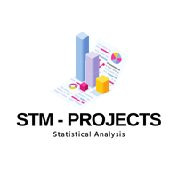
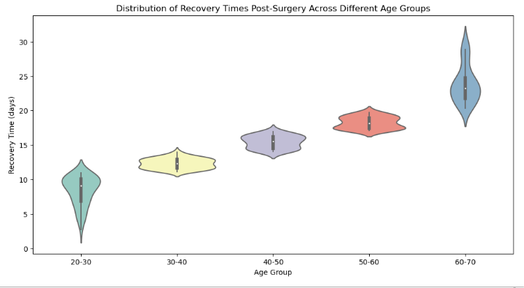
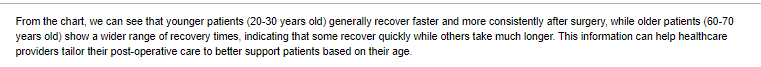

# Project10-STM-Post-Surgery-Recovery-Time
> **Brief Description:** To demonstrate the use of violin plots in visualizing the distribution of patient recovery times after surgery in different age groups.

---

## Table of Contents

- [Description](#description)
- [Video Explanation](#video)
- [Technologies Used](#technologies-used)
- [Dataset](#dataset)
- [Program Codes ](#program-codes)
- [Screenshots](#screenshots)
- [Contribution](#contributipn)
- [Contact Details](#contact-details)

---

## Description

To demonstrate the use of violin plots in visualizing the distribution of patient recovery times after surgery in different age groups.

## Video
<!--
 
-->

We are working on this section. Please check at some other time.

## Technologies-used

Python programming language, pandas and matplotlib package.

## Dataset

The data set is synthetically generated and used for demonstrating the concept only. The program can be easily modified to show results with real readings taken from the patients.

## Program-codes

The programs are written on jupiter notebook, You may run the program on Google colab by clicking on the colab badge below.

## Screenshots

The program generates and plots a violin plot to illustrate the distribution of recovery times after surgery across different age groups. Here's what the plot communicates in layman's terms:

### Plot Overview:
1. **Violin Plot**:
   - The violin plot shows the distribution of recovery times for different age groups.
   - It combines elements of a box plot and a density plot, providing a detailed view of the data distribution.

### Key Points:
1. **Age Groups**:
   - The x-axis represents different age groups.
   - Each violin represents the distribution of recovery times for one age group.

2. **Recovery Time (days)**:
   - The y-axis represents the recovery time in days.
   - The width of each violin represents the density of data points at different recovery times.

3. **Box Plot Elements**:
   - Inside each violin, a box plot shows the median, quartiles, and potential outliers.
   - The white dot represents the median recovery time.
   - The thick bar in the center represents the interquartile range (IQR), which contains the middle 50% of the data.
   - The thin line represents the rest of the data distribution, excluding outliers.

### Interpretation:
- **Distribution of Recovery Times**:
  - The shape of each violin shows how recovery times are distributed within each age group.
  - Wider sections of the violin indicate more common recovery times, while narrower sections indicate less common recovery times.

- **Comparison Across Age Groups**:
  - By comparing the shapes and positions of the violins, you can see how recovery times differ between age groups.
  - The box plot elements inside each violin provide additional details about the central tendency and variability of recovery times within each age group.

### In Layman's Terms:
The plot visually explains how recovery times after surgery vary among different age groups. Here's what each part means:

- **Violin Shape**: Each violin represents an age group and shows how common different recovery times are.
- **Width**: The wider the violin at a certain point, the more people had that recovery time.
- **Box Plot Inside**: The white dot shows the average recovery time, and the thick bar shows where most recovery times fall (the middle 50%).
- **Comparison**: By looking at the violins side by side, you can see which age groups tend to recover faster or slower after surgery.

This plot helps to understand the variability in recovery times among different age groups and provides a clear comparison of their distributions.

## Contribution

The programs are written by Santanu Karmakar

## Contact-details

If you wish to contact me, please leave a message (Preferably WhatsApp) on this number: 6291 894 897.
Please also mention why you are contacting me. Include your name and necessary details.
Thank you for taking an interest.
